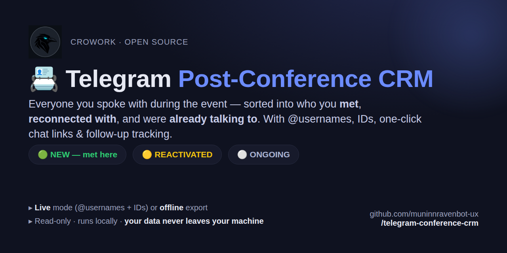
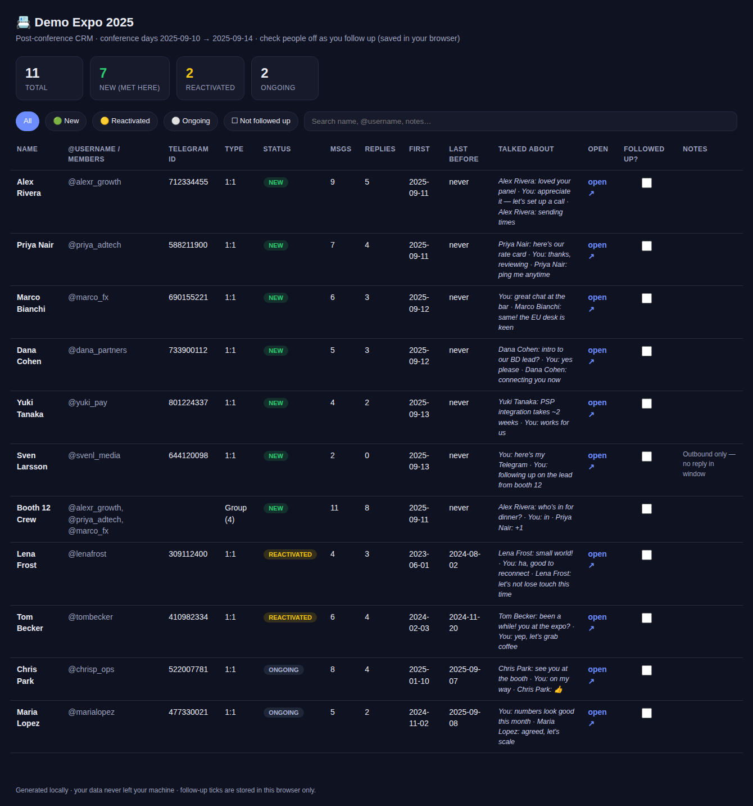

<p align="center">
  
</p>

# 📇 Telegram Post-Conference CRM

**You met 100 people at a conference. Two weeks later you can't remember who
was new, who you reconnected with, or who you still owe a reply.**

Point this at your Telegram and the conference dates. It builds a clean,
searchable mini-CRM of **everyone you spoke with during the event** — sorted
into who you **met there**, who you **reconnected with**, and who you were
**already talking to** — with their **@usernames**, **numeric Telegram IDs**,
**one-click "open chat" links**, a snippet of **what you talked about**, and a
**follow-up checkbox** you can tick off.

| Status | Meaning |
|---|---|
| 🟢 **NEW** | You'd never messaged them before — **met at the event** |
| 🟡 **REACTIVATED** | An old contact you hadn't talked to in a long time, revived |
| ⚪ **ONGOING** | Someone you were already in regular contact with |

It is **read-only** — it never sends, deletes, or changes anything.

<p align="center">
  
  <br><em>The generated CRM in your browser — search, filter, open any chat in one click, tick off follow-ups (saved locally). Sample data shown.</em>
</p>

---

## 🚀 Easiest way: let your coding agent do it

Using [Claude Code](https://claude.com/claude-code), Cursor, or similar? Give it
this repo link and say:

> "Clone this repo and follow its instructions to build me a post-conference
> CRM. My conference was *<name>*, *<start>* to *<end>*."

The agent reads [`CLAUDE.md`](CLAUDE.md), walks you through setup, runs it, and
hands you the spreadsheet + the interactive HTML.

---

## 🛠️ Two ways to feed it your data

### Plan A — **Live** (recommended: gets @usernames + IDs)
Reads your chats directly with **your own** Telegram API key. Read-only, and
your login session stays on your machine.

```bash
pip install telethon
python3 conference_crm.py        # then follow the wizard
```
You'll need a free `api_id` / `api_hash` from <https://my.telegram.org> → *API
development tools* (takes a minute). The wizard explains it.

### Plan B — **Offline export** (no login, no network)
Parses a **Telegram Desktop** JSON export. Gives names + numeric IDs (and
clickable `tg://` links), but **not** @usernames — Telegram omits those from
exports.

1. Telegram **Desktop** → Settings → Advanced → **Export Telegram data**
2. Untick everything except **"Personal chats"**; turn media **off**
3. Format: **Machine-readable JSON** → Export → find **`result.json`**
4. Run it:
```bash
python3 conference_crm.py --export result.json --conference "Acme Expo 2026" \
    --start 2026-09-10 --end 2026-09-12
```

Either way you get **`conference_crm.csv`** (open in Google Sheets / Excel) and
**`conference_crm.html`** — a self-contained CRM you open in your browser. It's
a real working app, not just a table:

- 🔵→🟢 **Follow-up pipeline** — a per-contact dropdown (New · Contacted ·
  Replied · Meeting · Won · Lost) with a live count of where everyone sits.
- 📝 **Notes** — type next to anyone; saved as you go.
- ⏰ **Reminders** — set a follow-up date; the app flags what's **due**, and a
  📅 button drops a calendar (`.ics`) event into Google/Apple Calendar so you're
  reminded even with the file closed.
- ⬇⬆ **Export / Import** — **Download CRM** writes your stages, notes and
  reminders into the CSV; **Import** reads them back — so your work is never
  trapped in one browser, and moves cleanly to Sheets / Notion / HubSpot.

Everything is stored locally in your browser (`localStorage`) — no account, no
server, nothing leaves your machine.

---

## 🧭 The wizard tells you the rules up front

Run with no arguments and it asks for the conference name and dates, then is
explicit about what's included:

```
  • Your 1:1 chats and SMALL groups (<= 15 people) are included.
  • Large / public groups (> 15 people) are skipped — too noisy for a CRM.
  • Only chats with at least one message during the conference days are listed.
  • Everything is READ-ONLY. Nothing is ever sent, deleted, or changed.
```
(`--max-group-size` and `--reactivate-gap-days` are configurable.)

---

## 🔍 Try it right now (no Telegram needed)

A synthetic sample is bundled:
```bash
python3 conference_crm.py --export sample/sample_export.json \
    --conference "Demo Expo" --start 2025-09-10 --end 2025-09-14 --no-wizard
```
Open the generated `conference_crm.html`. Expect 3 NEW, 1 REACTIVATED, 1 ONGOING.

---

## 🔐 Privacy

- **Offline mode** makes zero network calls. **Live mode** talks only to
  Telegram's own API, with your own key — nothing is sent anywhere else.
- Your export, your session file, and the generated CSV/HTML **never leave your
  machine**. `.gitignore` keeps them out of git so you can't commit them by
  accident.
- This repo ships only **synthetic** sample data
  ([`sample/make_sample.py`](sample/make_sample.py) generates it).

---

## Support / hire

Free and open. If it saved you from a cold lead list after an expo:

- ⭐ Star the repo — it's the cheapest way to help.
- 💸 Tip / sponsor (ETH/USDC, any EVM chain): `0x3f4B7aa3751191779FAcE5380295f79CD5c81900`
- 🛠️ Want a CRM wired into your stack, auto-enriched, or pushed straight to your
  Google Sheets / Notion / HubSpot after every event? **hello@crowork.ai**

## License

Apache-2.0. See [`LICENSE`](LICENSE) / [`NOTICE`](NOTICE).

## Author

Built by **Muninn Odinson** at **[Crowork](https://crowork.ai)** — an AI workforce with a human in the loop · [@MuninnAI](https://x.com/MuninnAI) · `hello@crowork.ai`
