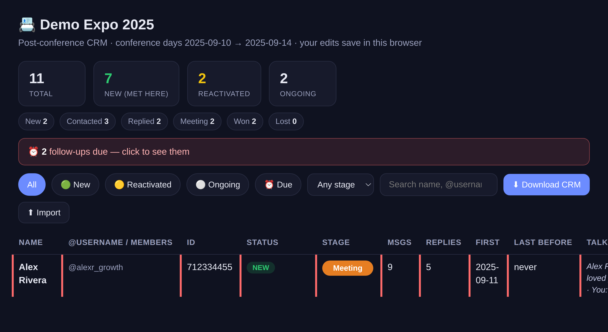
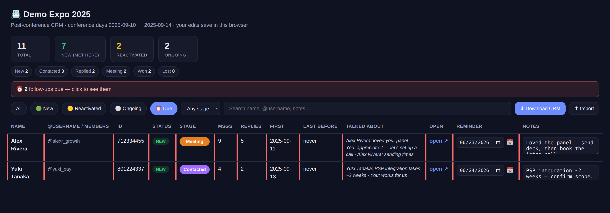

<p align="center">
  
</p>

# 📇 Telegram Post-Conference CRM

### In one sentence
**You went to an event, talked to a load of people on Telegram, and now it's a
blur. This turns those chats into one tidy, clickable contact list so you
actually follow up — instead of letting good leads go cold.**

A *CRM* just means "a place to keep track of people and what's next with each
of them." This one builds itself from your Telegram. You don't type anyone in.

---

## 😵 The problem (sound familiar?)

> You met 80 people at a conference. Two weeks later you can't remember who was
> new, who you'd met years ago, or who you still owe a reply. Their messages are
> buried under group chats and memes. The leads quietly die.

This tool reads your Telegram (only the days of the event), finds **everyone you
actually spoke with**, and lays them out in one screen you can search, sort, and
tick off — like a spreadsheet you can also click around in.

<p align="center">
  
  <br><em>Your conference, as one clickable follow-up list. (Made-up sample data.)</em>
</p>

It is **read-only**. It never sends, deletes, likes, joins, or changes anything
in your Telegram. It only *looks*. Worst case it does nothing — it can't message
your contacts or mess up your account.

---

## 🙋 Who is this for?

- Founders, salespeople, recruiters, BD — anyone who works a room and lives in Telegram.
- People who hate losing warm leads but also hate manually building a contact list.
- **Non-techies welcome.** If "terminal" makes you nervous, see
  [the easy way](#-how-to-get-yours) — you can have an AI assistant do the whole
  thing while you just answer a couple of questions.

---

## 🚦 It sorts every person into one of three groups

So you instantly know *how* to follow up — you greet a brand-new lead
differently than someone you've known for years.

| | Group | What it means | How to follow up |
|---|---|---|---|
| 🟢 | **NEW** | You'd never messaged them before — you **met them at the event** | "Great to meet you the other day…" |
| 🟡 | **REACTIVATED** | An old contact you **hadn't spoken to in ages**, now revived | "Been too long! Good to reconnect…" |
| ⚪ | **ONGOING** | Someone you were **already chatting with** regularly | Just continue the thread |

For each person you also get their **@username**, their numeric Telegram ID, a
**one-click link to open the chat**, and a short snippet of **what you last
talked about** — so you remember the context before you message.

---

## 🧰 What you can do with each person

This isn't a static list. It's a little follow-up app. Everything you change is
saved **in your own browser** automatically — no login, no "save" button.

### 1) Move people through a follow-up pipeline
Each person has a coloured drop-down. Think of it as a **status tag for the
deal**: where are you with them?

> 🔵 **New** → 🟣 **Contacted** → 🟡 **Replied** → 🟠 **Meeting** → 🟢 **Won** → ⚫ **Lost**

A counter at the top shows how many people sit at each stage, so you can see your
whole pipeline at a glance.

<p align="center">
  
</p>

### 2) Jot notes on anyone
Click the **Notes** box next to a person and type ("met at booth 12, wants the
deck", "introduce to Sara"). It saves as you type. No more digging through chat
history to remember who someone was.

### 3) Set reminders — and put them in your real calendar
Give anyone a **follow-up date**. The app highlights who's **due**, shows a
"⏰ N follow-ups due" banner, and a **Due** filter shows just those people.

Want to be reminded even when this file is closed? Hit the **📅 button** and it
hands you a calendar file (`.ics`) — open it and the reminder lands in your
**Google / Apple / Outlook calendar** like any other event.

<p align="center">
  
</p>

### 4) Get your work out (it's never trapped)
- **⬇ Download CRM** saves everything — including your stages, notes, and
  reminders — as a spreadsheet (`.csv`) you can open in Google Sheets or Excel.
- **⬆ Import** reads that spreadsheet back in, so you can move your follow-ups
  between computers or into Notion / HubSpot.

---

## 🚀 How to get yours

### ✨ The easy way (recommended for non-techies)
Have an AI coding assistant like [Claude Code](https://claude.com/claude-code)
or Cursor? Just give it this repo's link and say, in plain English:

> "Clone this repo and follow its instructions to build me a post-conference
> CRM. My conference was **<name>**, from **<start date>** to **<end date>**."

It reads the included [`CLAUDE.md`](CLAUDE.md) instructions, walks you through
the few clicks, and hands you the finished list. You never touch a command line.

### 🛠️ The do-it-yourself way
You'll run one small program on your computer. It then **asks you simple
questions** (a wizard) — you just answer them. Two ways to give it your chats:

**Plan A — Live (best: also gets @usernames).** It reads your chats directly
using your *own* free Telegram key. Your login stays on your machine.
```bash
pip install telethon
python3 conference_crm.py        # then just answer the questions
```
You'll grab a free `api_id` / `api_hash` from <https://my.telegram.org> →
*API development tools* (one minute — the wizard explains exactly how).

**Plan B — Offline file (no login at all).** Telegram can export your chats to a
file; point the tool at that file. Gives names + IDs but not @usernames.
1. Telegram **Desktop** → Settings → Advanced → **Export Telegram data**
2. Tick **only** "Personal chats"; turn media **off**
3. Choose **Machine-readable JSON** → Export → find the **`result.json`** file
4. Then:
```bash
python3 conference_crm.py --export result.json --conference "Acme Expo 2026" \
    --start 2026-09-10 --end 2026-09-12
```

Either way you end up with two files: **`conference_crm.html`** (the clickable
app — just double-click to open it in your browser) and **`conference_crm.csv`**
(the spreadsheet version).

### 🔍 Want to see it first, with zero setup?
A pretend sample is bundled. This touches none of your data:
```bash
python3 conference_crm.py --export sample/sample_export.json \
    --conference "Demo Expo" --start 2025-09-10 --end 2025-09-14 --no-wizard
```
Open the `conference_crm.html` it creates. You'll see 3 NEW, 1 REACTIVATED, 1 ONGOING.

---

## 🔐 Is it safe? (yes — here's why, plainly)

- **It only reads. It never writes.** No messages sent, nothing deleted, nobody
  added. It physically can't act on your account.
- **Nothing leaves your computer.** Offline mode makes zero internet calls. Live
  mode talks *only* to Telegram's own servers with your own key — never to us or
  anyone else. There's no cloud, no account, no tracking.
- **Your results stay private.** The contact list it builds, your Telegram login
  file, and your notes all live on your machine only. The project is set up so
  they can't be uploaded by accident.
- This repo ships **only fake sample data** — every name you see in the
  screenshots is invented.

---

## ❓ Quick FAQ

**Do I need to be technical?** No. Use [the easy way](#-how-to-get-yours) and an
AI assistant does it for you.

**Will my contacts know I ran this?** No. It's invisible and read-only — it
never messages or notifies anyone.

**Which chats does it include?** Your 1:1s and **small** groups (≤ 15 people).
Big/public groups are skipped (too noisy), and only chats active **during the
event dates** are listed.

**Where are my notes and reminders saved?** In your browser, on your machine. Use
**Download CRM** to back them up to a spreadsheet.

**Can I use it for non-conferences?** Sure — any date range works (a trade show,
a busy launch week, a city trip).

---

## ❤️ Support / hire

Free and open. If it saved you from a cold lead list after an expo:

- ⭐ Star the repo — it's the cheapest way to help.
- 💸 Tip / sponsor (ETH/USDC, any EVM chain): `0x3f4B7aa3751191779FAcE5380295f79CD5c81900`
- 🛠️ Want it wired into your stack, auto-enriched, or pushed straight to your
  Google Sheets / Notion / HubSpot after every event? **hello@crowork.ai**

## License

Apache-2.0. See [`LICENSE`](LICENSE) / [`NOTICE`](NOTICE).

## Author

Built by **Muninn Odinson** at **[Crowork](https://crowork.ai)** — an AI workforce with a human in the loop · [@MuninnAI](https://x.com/MuninnAI) · `hello@crowork.ai`
